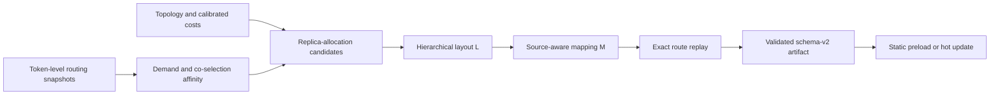

<div align="center">

# PlaceMoE

### Accelerating MoE Training through Expert Placement and Replica Coordination

[](LICENSE)
[](pyproject.toml)
[](https://github.com/pia7a/PlaceMoE)

</div>

PlaceMoE is a profile-guided system for distributed mixture-of-experts (MoE)
training. It jointly optimizes:

- the number of physical copies allocated to each logical expert;
- the hierarchical physical expert layout, denoted by `L`; and
- the source-aware token-to-copy mapping, denoted by `M`.

The key observation is that hierarchical token deduplication and expert
computation have different load semantics. Communication counts a token once
per destination group at each topology level, while expert computation must
execute every token--expert assignment. PlaceMoE models both costs, constructs
topology-aware `L,M` candidates, and selects the lowest-cost pair by replaying
the complete profiled token routes.

PlaceMoE is implemented on top of
[VeOmni](https://github.com/ByteDance-Seed/VeOmni) and retains its PyTorch-native
training stack, including FSDP2, expert parallelism, sequence parallelism,
multimodal training, and GPU/NPU backends.

## Highlights

- **Joint layout and mapping optimization.** PlaceMoE coordinates replica
  allocation, node-to-rank placement, and source-aware dispatch instead of
  optimizing expert load or communication independently.
- **Communication-aware candidate generation.** Profiled expert demand and
  token-level co-selection affinity guide capacity-constrained hierarchical
  partitioning and topology-general community proposals.
- **Exact candidate selection.** Pairwise statistics generate candidates, but
  complete token routes determine the final `L,M` pair through calibrated
  communication and expert-compute costs.
- **Static and adaptive execution.** A validated `L,M` artifact can be loaded
  at startup. During training, `M` can be refreshed without moving expert
  state, while a full `L,M` update migrates expert parameters and optimizer
  states at a training-step boundary.
- **Asynchronous planning.** CPU planning overlaps with training. Completed
  artifacts for all layers are validated before installation at a training-step
  boundary.
- **Replica-gradient overlap.** Gradients of physical copies are aggregated
  without changing logical model semantics, and synchronization is overlapped
  with same-layer attention backward.
- **Explicit compatibility boundary.** Fixed replication, EPLB, HierMoE, and
  historical swap/cover planners remain available as baselines but are not
  hidden dependencies of the canonical PlaceMoE optimizer.

## How PlaceMoE works



For every MoE layer, the canonical optimizer:

1. collects source-conditioned assignment demand and expert co-selection
   affinity from token-level routes;
2. retains a bounded shortlist of exact-budget replica allocations;
3. places physical copies across nodes and then ranks under slot capacities;
4. initializes and refines the source-aware mapping `M` over copies in `L`;
5. alternates layout and mapping refinement for a bounded number of rounds;
6. evaluates every retained pair on held-out complete routes; and
7. emits a schema-v2 artifact for static startup or a runtime update.

The optimizer preserves the router's logical top-k decisions. It changes only
where those assignments execute physically.

## Installation

PlaceMoE uses [uv](https://docs.astral.sh/uv/). Python 3.11 is the validated
environment, and the production path layers PlaceMoE over the tested VeOmni,
CANN, PyTorch, and torch-npu base stack.

```bash
git clone https://github.com/pia7a/PlaceMoE.git
cd PlaceMoE

# Ascend NPU on aarch64 (the validated production path)
python -m venv --system-site-packages .venv
uv pip install --python .venv/bin/python --no-deps --no-build-isolation .

source .venv/bin/activate
```

The current aarch64 release intentionally requires the validated preinstalled
CANN, PyTorch, torch-npu, and VeOmni runtime stack; it does not provision that
accelerator stack into a clean host. The `npu_aarch64` extra contains only the
additional Python development tools used on that stack. Distributed training
also requires working HCCL and shared access to the configured model, dataset,
and checkpoint paths. The production Dockerfile under `docker/ascend/`
configures this boundary automatically.

Build the validated production image with:

```bash
docker build -t placemoe:ascend -f docker/ascend/Dockerfile .
```

The default public VeOmni base is pinned by digest. Override `BASE_IMAGE` only
when the target cluster provides an equivalent Python 3.11 / CANN 9 / torch
2.9 / torch-npu 2.9 image.

For offline clusters and multi-node image distribution, see
[Packaging and distributing the Ascend image](docs/usage/placemoe_image_distribution.md).

On a new cluster, first calibrate the communication model with the same
distributed topology as training. Run this on every node with its own
`NODE_RANK`:

```bash
NNODES=2 NODE_RANK=0 NPROC_PER_NODE=8 \
MASTER_ADDR=192.168.0.10 MASTER_PORT=29501 \
  scripts/placemoe/calibrate_npu.sh calibration/runtime_perf_model.json \
  --hierarchy-group-sizes-csv 8,16
```

See [PlaceMoE pre-training](docs/usage/placemoe_pretraining.md) for calibration
and deployment details.

## Production configuration and launch

PlaceMoE is configured inside the normal VeOmni training YAML. The canonical
preset selects hierarchical token deduplication, source-aware dispatch,
step-boundary updates, and replica-gradient overlap; users do not configure the
historical swap/cover planners.

Add the following block to a Qwen, DeepSeek, or another VeOmni MoE training
configuration and replace the deployment-specific paths and topology:

```yaml
train:
  accelerator:
    ep_size: 16
    dp_shard_size: 16
  hiermoe:
    redundant_slot_increment_per_device: 4
    hierarchy_group_sizes: [8, 16]
    placemoe:
      enabled: true
      base_directory: /shared/placemoe
      initial_artifact: ""  # optional; empty starts from the default layout
      runtime_perf_model: calibration/runtime_perf_model.json
      calibration:
        artifact: calibration/placemoe_calibration.json
      hot_update:
        enabled: true
        layout_interval_steps: 100
        mapping_interval_steps: 20
        work_root: runs/placemoe_planner
        failure_policy: continue
      resources:
        workers: 48
        candidate_workers: 4
        worker_threads: 1
```

`redundant_slot_increment_per_device`, `hierarchy_group_sizes`, and both
calibration artifacts describe the target model and cluster. If
`initial_artifact` is empty, configure a positive layout interval so PlaceMoE
can create replicas after collecting routes. Validate the environment and all
paths before reserving a distributed job:

```bash
.venv/bin/placemoe doctor --config configs/my_train.yaml
```

Run the same checkout and configuration on every node. For a 2-node Ascend
job, for example:

```bash
NNODES=2 NODE_RANK=0 NPROC_PER_NODE=8 \
MASTER_ADDR=192.168.0.10 MASTER_PORT=29500 \
  scripts/placemoe/launch_npu.sh tasks/train_vlm.py configs/my_train.yaml
```

Set `NODE_RANK=1` on the second node. The launcher is model agnostic: use
`tasks/train_vlm.py` for multimodal models and `tasks/train_text.py` for text
models. Model-specific expert tensors are exposed through
`MoEModelAdapter`; stacked fused and split gate/up projections work without a
model-name branch, and other layouts can register a small adapter.

Scripts under `scripts/placemoe/reproduction/` preserve paper testbeds and are
not production configuration interfaces.

### Using an existing VeOmni model integration

The trainer and EP host call PlaceMoE through the versioned
`veomni.moe_runtime_bridges` interface. A user who has only added or modified a
model in VeOmni should carry those model files, registration, and parallel plan
into this checkout; the training loop does not require model-specific PlaceMoE
patches. Fused `gate_up_proj`/`down_proj` and split
`gate_proj`/`up_proj`/`down_proj` experts are detected automatically. Other
representations register one adapter through the public
`placemoe.register_moe_model_adapter` API.

PlaceMoE fails before training if no expert adapter matches. It also requires
replica-gradient overlap hooks to register and execute; blocking replica
synchronization is never selected implicitly.

## Controlling layout and mapping updates

`L` and `M` use independent update intervals:

| `layout_interval_steps` | `mapping_interval_steps` | Runtime behavior |
| ---: | ---: | --- |
| `0` | `0` | Keep the startup `L,M` static. |
| `100` | `0` | Recompute and install `L,M` every 100 steps. |
| `0` | `20` | Keep `L` fixed and refresh only the dispatch lookup table `M`. |
| `100` | `20` | Refresh `M` every 20 steps and perform a full update every 100 steps. |

When both events are due at the same step, the full update subsumes the
mapping-only event. At most one planner process runs at a time; later events
are coalesced while training continues with the current pair. With
`failure_policy: continue`, a failed planner leaves the current pair active;
`raise` turns planner failure into a training error.

## Canonical interfaces

| Path | Purpose |
| --- | --- |
| `veomni/distributed/moe/hiermoe/placemoe/` | Routing statistics, allocation, placement, mapping, exact-cost optimization, and artifact validation. |
| `veomni/distributed/moe/hiermoe/placemoe/runtime/` | Typed configuration, independent update scheduling, asynchronous planner control, and process construction. |
| `veomni/distributed/moe/runtime_bridge.py` | Versioned lifecycle boundary between VeOmni and an MoE runtime provider. |
| `placemoe/model_adapter.py` | Public model boundary for expert parameters and fused-kernel weights. |
| `scripts/profile/plan_placemoe.py` | Canonical offline and runtime planner CLI. |
| `scripts/placemoe/launch_npu.sh` | Thin, model-independent multi-node NPU launcher. |
| `scripts/placemoe/reproduction/npu_ep32.sh` | Original NPU EP32 paper-reproduction launcher. |
| `scripts/placemoe/reproduction/gpu_ep32/` | GPU EP32 calibration and paper-reproduction matrix. |
| `configs/placemoe/` | Example runtime and calibration configurations. |

Inspect the planner options with:

```bash
python scripts/profile/plan_placemoe.py --help
```

The historical `build_hiermoe_recursive_classifier_layout.py` command is a
deprecated compatibility wrapper. New integrations use `plan_placemoe.py` and
the nested `train.hiermoe.placemoe` configuration. `VEOMNI_PLACEMOE_CONFIG`
and legacy `VEOMNI_HIERMOE_*` variables remain only for older launchers and
paper-reproduction workflows. Using `VEOMNI_PLACEMOE_CONFIG` additionally
requires `VEOMNI_PLACEMOE_USE_LEGACY_CONFIG=1`; otherwise the canonical inline
configuration is used. The legacy `config_path` input is exclusive and cannot
be mixed with inline PlaceMoE fields.

For a module-by-module explanation, see the
[PlaceMoE code map](docs/perf/placemoe_code_map.md).
For model-only VeOmni forks, see
[the versioned bridge integration guide](docs/usage/placemoe_veomni_bridge.md).

## Results

Experiments with the repository implementation evaluate PlaceMoE on multi-node
GPU and NPU clusters with Qwen3-VL and DeepSeek-V3 using multimodal and text
workloads. Relative to the unmodified VeOmni runtime, PlaceMoE achieves:

| Metric | Result |
| --- | ---: |
| Hierarchical A2A speedup | up to `6.94x` |
| End-to-end training speedup | `1.74x`--`2.33x` |
| End-to-end speedup over the strongest same-runtime baseline | `1.05x`--`1.25x` |

A 600-step experiment reports `2.16x` average speedup over VeOmni with a
tighter step-time band. CPU optimization runs asynchronously, and 5 periodic
updates expose `58.6 s` in total, or `0.64%` of the run.

Workload definitions, reproduction procedures, and detailed measurements are
documented separately:

- [Experiment reproduction record](docs/perf/placemoe_paper_reproduction_20260802.md)
- [General planner E2E validation](docs/perf/placemoe_general_e2e_validation_20260802.md)

## Supported and validated scope

- The canonical general workflow is validated with Qwen3-VL and a
  6-MoE-layer DeepSeek-V3 configuration.
- PlaceMoE is evaluated on multi-node NVIDIA GPU/NCCL and Ascend NPU/HCCL
  platforms with hierarchical node-to-rank communication.
- The general planner consumes the target communication hierarchy, EP
  topology, replica budget, and slot capacities through the same optimization
  workflow across supported deployments.
- A mapping-only update replaces the runtime lookup table without expert-state
  movement; a full update migrates expert parameters and optimizer states and
  installs `L,M` at a training-step boundary after validating all layer
  artifacts.
- PlaceMoE does not currently support FSDP2 CPU offload when replicated expert
  placement is enabled.

Other VeOmni model families and training tasks remain in the repository, but
they should not be treated as validated PlaceMoE workloads without a matching
route collector, calibration artifact, and runtime integration test.

## Testing

The focused CPU suite covers statistics, replica allocation, hierarchical
placement, mapping refinement, exact candidate selection, artifact validation,
runtime configuration, and hot-update scheduling:

```bash
python -m pytest \
  tests/distributed/test_placemoe_optimizer.py \
  tests/distributed/test_placemoe_runtime.py \
  tests/distributed/test_placemoe_runtime_config.py \
  tests/distributed/test_hiermoe_recursive_classifier_init.py
```

Before contributing, run the repository quality checks:

```bash
make style
make quality
```

Distributed end-to-end tests require the corresponding multi-GPU or multi-NPU
environment and are not part of the default CPU test suite.

## Repository lineage and citation

PlaceMoE is derived from VeOmni and retains its Apache-2.0 license and general
training infrastructure. If this repository is useful in your work, please
cite the PlaceMoE paper when its public citation is available and acknowledge
the VeOmni project:

```bibtex
@article{ma2025veomni,
  title={VeOmni: Scaling Any Modality Model Training with Model-Centric Distributed Recipe Zoo},
  author={Ma, Qianli and Zheng, Yaowei and Shi, Zhelun and Zhao, Zhongkai and Jia, Bin and Huang, Ziyue and Lin, Zhiqi and Li, Youjie and Yang, Jiacheng and Peng, Yanghua and others},
  journal={arXiv preprint arXiv:2508.02317},
  year={2025}
}
```

## License

This project is licensed under the [Apache License 2.0](LICENSE).
