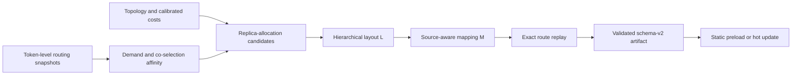

<div align="center">

# PlaceMoE

### Accelerating MoE Training through Expert Placement and Replica Coordination

[](LICENSE)
[](pyproject.toml)
[](https://github.com/pia7a/PlaceMoE)

</div>

PlaceMoE is a profile-guided system for distributed mixture-of-experts (MoE)
training. It jointly optimizes:

- the number of physical copies allocated to each logical expert;
- the hierarchical physical expert layout, denoted by `L`; and
- the source-aware token-to-copy mapping, denoted by `M`.

The key observation is that hierarchical token deduplication and expert
computation have different load semantics. Communication counts a token once
per destination group at each topology level, while expert computation must
execute every token--expert assignment. PlaceMoE models both costs, constructs
topology-aware `L,M` candidates, and selects the lowest-cost pair by replaying
the complete profiled token routes.

PlaceMoE is implemented on top of
[VeOmni](https://github.com/ByteDance-Seed/VeOmni) and retains its PyTorch-native
training stack, including FSDP2, expert parallelism, sequence parallelism,
multimodal training, and GPU/NPU backends.

## Highlights

- **Joint layout and mapping optimization.** PlaceMoE coordinates replica
  allocation, node-to-rank placement, and source-aware dispatch instead of
  optimizing expert load or communication independently.
- **Communication-aware candidate generation.** Profiled expert demand and
  token-level co-selection affinity guide capacity-constrained hierarchical
  partitioning and topology-general community proposals.
- **Exact candidate selection.** Pairwise statistics generate candidates, but
  complete token routes determine the final `L,M` pair through calibrated
  communication and expert-compute costs.
- **Static and adaptive execution.** A validated `L,M` artifact can be loaded
  at startup. During training, `M` can be refreshed without moving expert
  state, while a full `L,M` update migrates expert parameters and optimizer
  states at a training-step boundary.
- **Asynchronous planning.** CPU planning overlaps with training. Completed
  artifacts are validated before an atomic mapping or layout installation.
- **Replica-gradient overlap.** Gradients of physical copies are aggregated
  without changing logical model semantics, and synchronization is overlapped
  with same-layer attention backward.
- **Explicit compatibility boundary.** Fixed replication, EPLB, HierMoE, and
  historical swap/cover planners remain available as baselines but are not
  hidden dependencies of the canonical PlaceMoE optimizer.

## How PlaceMoE works



For every MoE layer, the canonical optimizer:

1. collects source-conditioned assignment demand and expert co-selection
   affinity from token-level routes;
2. retains a bounded shortlist of exact-budget replica allocations;
3. places physical copies across nodes and then ranks under slot capacities;
4. initializes and refines the source-aware mapping `M` over copies in `L`;
5. alternates layout and mapping refinement for a bounded number of rounds;
6. evaluates every retained pair on held-out complete routes; and
7. emits a schema-v2 artifact for static startup or a runtime update.

The optimizer preserves the router's logical top-k decisions. It changes only
where those assignments execute physically.

## Installation

PlaceMoE uses [uv](https://docs.astral.sh/uv/) and targets the dependency
versions pinned in `pyproject.toml` and `uv.lock`. Python 3.11 is the validated
environment.

```bash
git clone https://github.com/pia7a/PlaceMoE.git
cd PlaceMoE

# Ascend NPU on x86
uv sync --extra npu --dev

# Or use exactly one alternative hardware extra:
# uv sync --extra npu_aarch64 --dev
# uv sync --extra gpu --dev

source .venv/bin/activate
```

The `gpu`, `npu`, and `npu_aarch64` extras are mutually exclusive. Distributed
training additionally requires a working NCCL or HCCL environment and shared
access to the model, dataset, and checkpoint paths referenced by the VeOmni
training configuration.

## Production configuration and launch

The production entry point uses one PlaceMoE YAML file for startup placement,
calibration, planner resources, and training-time updates:

```bash
bash scripts/placemoe/pretrain.sh \
  configs/placemoe/local.yaml \
  qwen3vl sharegpt4v full
```

Before launching, create `configs/placemoe/local.yaml` from the following
template and ensure that its artifact paths exist in your environment:

```yaml
placemoe:
  initial_artifact: ../../results/placemoe_layout.json
  runtime_perf_model: ../../results/placemoe_runtime_perf_model.json
  calibration:
    artifact: calibration/placemoe_calibration.json
  hot_update:
    enabled: true
    layout_interval_steps: 100
    mapping_interval_steps: 20
    last_update_step: 500
    work_root: ../../profile/runs/pretrain/placemoe_hot_update
    failure_policy: continue
  resources:
    workers: 48
    candidate_workers: 4
    worker_threads: 1
    planner_cpu_ids: 144-191
    training_cpu_ids: 0-143
```

All paths are resolved relative to the PlaceMoE configuration file. The
launcher validates the initial artifact, topology, calibration metadata,
runtime performance model, and CPU affinities before reserving accelerators:

```bash
python scripts/placemoe/validate_config.py \
  configs/placemoe/local.yaml
```

The included `pretrain.sh` is a reference distributed launcher. For another
cluster allocation, adapt its host, container, model, and dataset settings or
set `VEOMNI_PLACEMOE_CONFIG` from an existing VeOmni launcher. The canonical
optimizer and artifact schema are independent of a particular EP size; the
configuration, routing snapshots, slot capacities, and calibration artifacts
must describe the target deployment consistently.

See [PlaceMoE pre-training](docs/usage/placemoe_pretraining.md) for deployment,
source synchronization, artifact distribution, and failure-policy details.

## Controlling layout and mapping updates

`L` and `M` use independent update intervals:

| `layout_interval_steps` | `mapping_interval_steps` | Runtime behavior |
| ---: | ---: | --- |
| `0` | `0` | Keep the startup `L,M` static. |
| `100` | `0` | Recompute and install `L,M` every 100 steps. |
| `0` | `20` | Keep `L` fixed and refresh only the dispatch lookup table `M`. |
| `100` | `20` | Refresh `M` every 20 steps and perform a full update every 100 steps. |

When both events are due at the same step, the full update subsumes the
mapping-only event. At most one planner process runs at a time; later events
are coalesced while training continues with the current pair. With
`failure_policy: continue`, a failed planner leaves the current pair active;
`raise` turns planner failure into a training error.

## Canonical interfaces

| Path | Purpose |
| --- | --- |
| `veomni/distributed/moe/hiermoe/placemoe/` | Routing statistics, allocation, placement, mapping, exact-cost optimization, and artifact validation. |
| `veomni/distributed/moe/hiermoe/placemoe/runtime/` | Typed configuration, independent update scheduling, asynchronous planner control, and process construction. |
| `scripts/profile/plan_placemoe.py` | Canonical offline and runtime planner CLI. |
| `scripts/placemoe/pretrain.sh` | Reference distributed pre-training launcher with config and artifact validation. |
| `configs/placemoe/` | Example runtime and calibration configurations. |

Inspect the planner options with:

```bash
python scripts/profile/plan_placemoe.py --help
```

The historical `build_hiermoe_recursive_classifier_layout.py` command is a
deprecated compatibility wrapper. New integrations should use
`plan_placemoe.py` or set `VEOMNI_PLACEMOE_CONFIG`; legacy
`VEOMNI_HIERMOE_*` variables remain available only for older launchers and
paper-reproduction workflows.

For a module-by-module explanation, see the
[PlaceMoE code map](docs/perf/placemoe_code_map.md).

## Results

Experiments with the repository implementation evaluate PlaceMoE on multi-node
GPU and NPU clusters with Qwen3-VL and DeepSeek-V3 using multimodal and text
workloads. Relative to the unmodified VeOmni runtime, PlaceMoE achieves:

| Metric | Result |
| --- | ---: |
| Hierarchical A2A speedup | up to `6.94x` |
| End-to-end training speedup | `1.74x`--`2.33x` |
| End-to-end speedup over the strongest same-runtime baseline | `1.05x`--`1.25x` |

A 600-step experiment reports `2.16x` average speedup over VeOmni with a
tighter step-time band. CPU optimization runs asynchronously, and 5 periodic
updates expose `58.6 s` in total, or `0.64%` of the run.

Workload definitions, reproduction procedures, and detailed measurements are
documented separately:

- [Experiment reproduction record](docs/perf/placemoe_paper_reproduction_20260802.md)
- [General planner E2E validation](docs/perf/placemoe_general_e2e_validation_20260802.md)

## Supported and validated scope

- The canonical general workflow is validated with Qwen3-VL and a
  6-MoE-layer DeepSeek-V3 configuration.
- PlaceMoE is evaluated on multi-node NVIDIA GPU/NCCL and Ascend NPU/HCCL
  platforms with hierarchical node-to-rank communication.
- The general planner consumes the target communication hierarchy, EP
  topology, replica budget, and slot capacities through the same optimization
  workflow across supported deployments.
- A mapping-only update replaces the runtime lookup table without expert-state
  movement; a full update migrates expert parameters and optimizer states and
  atomically installs `L,M` at a step boundary.
- PlaceMoE does not currently support FSDP2 CPU offload when replicated expert
  placement is enabled.

Other VeOmni model families and training tasks remain in the repository, but
they should not be treated as validated PlaceMoE workloads without a matching
route collector, calibration artifact, and runtime integration test.

## Testing

The focused CPU suite covers statistics, replica allocation, hierarchical
placement, mapping refinement, exact candidate selection, artifact validation,
runtime configuration, and hot-update scheduling:

```bash
python -m pytest \
  tests/distributed/test_placemoe_optimizer.py \
  tests/distributed/test_placemoe_runtime.py \
  tests/distributed/test_placemoe_runtime_config.py \
  tests/distributed/test_hiermoe_recursive_classifier_init.py
```

Before contributing, run the repository quality checks:

```bash
make style
make quality
```

Distributed end-to-end tests require the corresponding multi-GPU or multi-NPU
environment and are not part of the default CPU test suite.

## Repository lineage and citation

PlaceMoE is derived from VeOmni and retains its Apache-2.0 license and general
training infrastructure. If this repository is useful in your work, please
cite the PlaceMoE paper when its public citation is available and acknowledge
the VeOmni project:

```bibtex
@article{ma2025veomni,
  title={VeOmni: Scaling Any Modality Model Training with Model-Centric Distributed Recipe Zoo},
  author={Ma, Qianli and Zheng, Yaowei and Shi, Zhelun and Zhao, Zhongkai and Jia, Bin and Huang, Ziyue and Lin, Zhiqi and Li, Youjie and Yang, Jiacheng and Peng, Yanghua and others},
  journal={arXiv preprint arXiv:2508.02317},
  year={2025}
}
```

## License

This project is licensed under the [Apache License 2.0](LICENSE).
