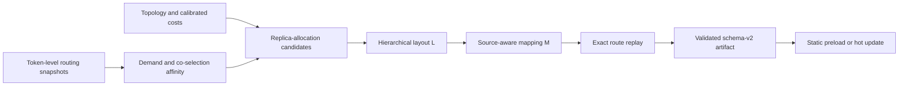

<div align="center">

# PlaceMoE

### 通过专家放置与副本协同加速 MoE 训练

[English](README.md) | 中文

[](LICENSE)
[](pyproject.toml)
[](https://github.com/pia7a/PlaceMoE)

</div>

PlaceMoE 是一个面向分布式混合专家（MoE）训练的 profile-guided 系统，联合优化：

- 为每个逻辑专家分配的物理副本数量；
- 分层物理专家布局 `L`；
- source-aware token-to-copy mapping `M`。

其核心观察是：分层 token deduplication 与专家计算具有不同的负载语义。通信在
每个拓扑层级的每个目标 group 中只统计一次 token，而专家计算必须执行每个
token--expert assignment。PlaceMoE 对两类代价共同建模，构造 topology-aware
`L,M` candidates，并通过重放完整的 profiled token routes 选择代价最低的组合。

PlaceMoE 基于 [VeOmni](https://github.com/ByteDance-Seed/VeOmni) 实现，保留其
PyTorch-native 训练栈，包括 FSDP2、专家并行、序列并行、多模态训练以及 GPU/NPU
后端。

## 主要特性

- **联合优化布局与映射。**PlaceMoE 协同优化副本分配、node-to-rank 放置和
  source-aware dispatch，而不是单独优化专家负载或通信；
- **通信感知的候选生成。**使用 profiled expert demand 和 token-level
  co-selection affinity 指导容量约束分层 partitioning 和拓扑通用 community
  proposals；
- **精确候选选择。**Pairwise statistics 用于生成候选，最终 `L,M` 则由完整
  token routes 上经校准的通信和 expert-compute costs 决定；
- **静态与自适应执行。**可以在启动时加载已验证的 `L,M` artifact。训练过程中，
  `M` 可以在不移动 expert state 的情况下更新；完整 `L,M` 更新则在训练 step
  边界迁移专家参数和 optimizer states；
- **异步规划。**CPU planning 与训练重叠。所有层的 artifact 完成并通过验证后，
  才会在训练 step 边界安装；
- **Replica-gradient overlap。**聚合同一逻辑专家的物理副本梯度而不改变模型
  语义，并将同步与同层 attention backward 重叠；
- **明确的兼容边界。**Fixed replication、EPLB、HierMoE 和历史 swap/cover
  planners 作为基线保留，但不是 canonical PlaceMoE optimizer 的隐藏依赖。

## PlaceMoE 工作流程



对于每个 MoE 层，canonical optimizer：

1. 采集 source-conditioned assignment demand 和 expert co-selection affinity；
2. 保留满足精确预算的有界副本分配候选集合；
3. 在 slot capacity 约束下先跨节点、再跨 rank 放置物理副本；
4. 在 `L` 提供的副本上初始化并优化 source-aware mapping `M`；
5. 在有界轮数内交替优化 layout 和 mapping；
6. 在 held-out 完整 routes 上评估所有保留的组合；
7. 输出用于静态启动或 runtime update 的 schema-v2 artifact。

optimizer 保持 router 的逻辑 top-k 决策不变，只改变这些 assignments 的物理执行
位置。

## 安装

PlaceMoE 使用 [uv](https://docs.astral.sh/uv/)。验证环境使用 Python 3.11；生产
路径将 PlaceMoE 安装在经过验证的 VeOmni、CANN、PyTorch 和 torch-npu 基础
软件栈之上。

```bash
git clone https://github.com/pia7a/PlaceMoE.git
cd PlaceMoE

# Ascend NPU on aarch64（已验证的生产路径）
python -m venv --system-site-packages .venv
uv pip install --python .venv/bin/python --no-deps --no-build-isolation .

source .venv/bin/activate
```

当前 aarch64 release 要求预先安装经过验证的 CANN、PyTorch、torch-npu 和
VeOmni runtime stack，不会在干净宿主机中自动部署加速器软件栈。
`npu_aarch64` extra 只包含该软件栈上使用的附加 Python 开发工具。分布式训练还
要求可正常工作的 HCCL，以及所有节点能够访问配置的模型、数据集和 checkpoint
路径。`docker/ascend/` 下的生产 Dockerfile 会自动配置这条边界。

构建经过验证的生产镜像：

```bash
docker build -t placemoe:ascend -f docker/ascend/Dockerfile .
```

默认使用按 digest 固定的公开 VeOmni 基础镜像。只有当目标集群提供等价的
Python 3.11 / CANN 9 / torch 2.9 / torch-npu 2.9 镜像时，才应覆盖
`BASE_IMAGE`。

离线集群和多节点镜像分发见
[Ascend 镜像打包与分发](docs/usage/placemoe_image_distribution_zh.md)。加载镜像后，
按照 [Ascend 容器快速入门](docs/usage/placemoe_container_quickstart_zh.md)
挂载 NPU、模型、数据集、配置、源码和输出并启动训练。

在训练 YAML 中设置 runtime 和 planner artifact 路径后，推荐使用准备命令只
创建缺失的 artifact。以与训练相同的分布式设置在每个节点运行，并只修改
`NODE_RANK`：

```bash
NNODES=2 NODE_RANK=0 NPROC_PER_NODE=8 \
MASTER_ADDR=192.168.0.10 MASTER_PORT=29501 \
  placemoe prepare \
  --config configs/my_train.yaml \
  --entrypoint tasks/train_vlm.py
```

相同 accelerator、通信 backend、软件栈、数据类型和 EP 拓扑可以复用 topology
calibration。随后运行的 5-step 默认布局任务拟合模型相关 planner costs。有效
artifact 会被复用，缺失 artifact 会被创建；除非显式强制对应阶段，已有但无效
的 artifact 会直接报错。两个阶段也可以分别通过
`placemoe calibrate-runtime` 和 `placemoe calibrate-model` 运行。

校准复用规则、独立命令和部署细节见
[PlaceMoE 预训练指南](docs/usage/placemoe_pretraining_zh.md)。

## 生产配置与启动

PlaceMoE 配置在普通 VeOmni 训练 YAML 中。Canonical preset 会启用分层 token
deduplication、source-aware dispatch、step-boundary updates 和
replica-gradient overlap；用户无需配置历史 swap/cover planners。

将下面配置加入 Qwen、DeepSeek 或其他 VeOmni MoE 训练配置，并替换与部署相关的
路径和拓扑：

```yaml
train:
  accelerator:
    ep_size: 16
    dp_shard_size: 16
  hiermoe:
    redundant_slot_increment_per_device: 4
    hierarchy_group_sizes: [8, 16]
    placemoe:
      enabled: true
      base_directory: /shared/placemoe
      initial_artifact: ""  # 可选；为空时从默认布局开始
      runtime_perf_model: calibration/runtime_perf_model.json
      calibration:
        artifact: calibration/placemoe_calibration.json
      hot_update:
        enabled: true
        layout_interval_steps: 100
        mapping_interval_steps: 20
        work_root: runs/placemoe_planner
        failure_policy: continue
      resources:
        workers: 48
        candidate_workers: 4
        worker_threads: 1
```

`redundant_slot_increment_per_device`、`hierarchy_group_sizes` 和两个 calibration
artifacts 描述目标模型和集群。如果 `initial_artifact` 为空，需要设置正数 layout
interval，使 PlaceMoE 能在采集 routes 后创建副本。预留分布式资源前检查环境和
所有路径：

```bash
.venv/bin/placemoe doctor --config configs/my_train.yaml
```

每个节点使用相同 checkout 和配置。双节点 Ascend 任务示例：

```bash
NNODES=2 NODE_RANK=0 NPROC_PER_NODE=8 \
MASTER_ADDR=192.168.0.10 MASTER_PORT=29500 \
  scripts/placemoe/launch_npu.sh tasks/train_vlm.py configs/my_train.yaml
```

第二个节点设置 `NODE_RANK=1`。launcher 与模型无关：多模态模型使用
`tasks/train_vlm.py`，文本模型使用 `tasks/train_text.py`。模型专用 expert
tensors 通过 `MoEModelAdapter` 暴露；堆叠 fused `gate_up_proj`/`down_proj`
和 split `gate_proj`/`up_proj`/`down_proj` 会被自动识别，其他布局只需注册一个
小型 adapter。

`scripts/placemoe/reproduction/` 下的脚本保留论文 testbeds，不属于生产配置接口。

### 使用已有的 VeOmni 模型集成

trainer 和 EP host 通过版本化的 `veomni.moe_runtime_bridges` 接口调用 PlaceMoE。
如果用户只在 VeOmni 中新增或修改了模型，应将这些模型文件、注册和 parallel
plan 迁移到当前 checkout；训练循环不需要模型专用 PlaceMoE patches。Fused
`gate_up_proj`/`down_proj` 和 split `gate_proj`/`up_proj`/`down_proj` experts
会被自动识别。其他表示通过公共 `placemoe.register_moe_model_adapter` API 注册
一个 adapter。

如果没有 expert adapter 能匹配，PlaceMoE 会在训练前失败。它还要求
replica-gradient overlap hooks 成功注册并执行，绝不会隐式选择阻塞副本同步。

## 控制布局与映射更新

`L` 和 `M` 具有独立更新周期：

| `layout_interval_steps` | `mapping_interval_steps` | Runtime 行为 |
| ---: | ---: | --- |
| `0` | `0` | 保持启动时的 `L,M` 不变。 |
| `100` | `0` | 每 100 步重新计算并安装 `L,M`。 |
| `0` | `20` | 保持 `L` 不变，只更新 dispatch lookup table `M`。 |
| `100` | `20` | 每 20 步更新 `M`，每 100 步执行一次完整更新。 |

当两个事件在同一步到期时，完整更新会包含 mapping-only 事件。任一时刻最多运行
一个 planner process；训练继续使用当前组合，后续事件会在 planner 运行时合并。
`failure_policy: continue` 会在 planner 失败时保留当前组合；`raise` 则将 planner
失败转为训练错误。

## Canonical 接口

| 路径 | 用途 |
| --- | --- |
| `veomni/distributed/moe/hiermoe/placemoe/` | Routing statistics、副本分配、分层 placement、mapping refinement、exact-cost optimization 和 artifact validation。 |
| `veomni/distributed/moe/hiermoe/placemoe/runtime/` | 类型化配置、独立更新调度、异步 planner 控制和 process 构造。 |
| `veomni/distributed/moe/runtime_bridge.py` | VeOmni 与 MoE runtime provider 之间的版本化 lifecycle 边界。 |
| `placemoe/model_adapter.py` | expert 参数和 fused-kernel weights 的公共模型边界。 |
| `scripts/profile/plan_placemoe.py` | Canonical offline/runtime planner CLI。 |
| `scripts/placemoe/launch_npu.sh` | 简洁、与模型无关的多节点 NPU launcher。 |
| `scripts/placemoe/reproduction/npu_ep32.sh` | 原始 NPU EP32 论文复现 launcher。 |
| `scripts/placemoe/reproduction/gpu_ep32/` | GPU EP32 校准与论文复现实验矩阵。 |
| `configs/placemoe/` | Runtime 和 calibration 配置示例。 |

查看 planner 参数：

```bash
python scripts/profile/plan_placemoe.py --help
```

历史 `build_hiermoe_recursive_classifier_layout.py` 是 deprecated compatibility
wrapper。新集成使用 `plan_placemoe.py` 和嵌套的
`train.hiermoe.placemoe` 配置。`VEOMNI_PLACEMOE_CONFIG` 和旧的
`VEOMNI_HIERMOE_*` 变量只为历史 launcher 和论文复现保留。使用
`VEOMNI_PLACEMOE_CONFIG` 还要求设置 `VEOMNI_PLACEMOE_USE_LEGACY_CONFIG=1`，
否则使用 canonical inline 配置。Legacy `config_path` 是排他输入，不能与 inline
PlaceMoE fields 混用。

模块说明见 [PlaceMoE 代码导览](docs/perf/placemoe_code_map_zh.md)。模型专用
VeOmni fork 的集成方式见
[版本化 bridge 集成指南](docs/usage/placemoe_veomni_bridge_zh.md)。

## 实验结果

仓库实现使用 Qwen3-VL 和 DeepSeek-V3，在多节点 GPU/NPU 集群上的多模态与文本
任务中评估 PlaceMoE。相对未修改的 VeOmni runtime，PlaceMoE 达到：

| 指标 | 结果 |
| --- | ---: |
| 分层 A2A 加速比 | 最高 `6.94x` |
| 端到端训练加速比 | `1.74x`--`2.33x` |
| 相对最强同 runtime baseline 的端到端加速比 | `1.05x`--`1.25x` |

600-step 实验中，PlaceMoE 相对 VeOmni 达到 `2.16x` 平均加速，并具有更集中的
step-time band。CPU optimization 异步运行，5 次周期更新总共只暴露 `58.6 s`，
占整个任务的 `0.64%`。

Workload 定义、复现流程和详细测量记录在：

- [论文实验复现记录](docs/perf/placemoe_paper_reproduction_20260802.md)；
- [General planner 端到端验证](docs/perf/placemoe_general_e2e_validation_20260802.md)。

## 支持与验证范围

- Canonical general workflow 已使用 Qwen3-VL 和 6-MoE-layer DeepSeek-V3
  配置验证；
- PlaceMoE 已在采用分层 node-to-rank 通信的多节点 NVIDIA GPU/NCCL 和 Ascend
  NPU/HCCL 平台上评估；
- general planner 在所有支持部署中通过同一优化流程接收目标通信层级、EP
  拓扑、副本预算和 slot capacities；
- mapping-only 更新在不移动 expert state 的情况下替换 runtime lookup table；
  完整更新则在验证所有层 artifact 后迁移专家参数和 optimizer states，并在训练
  step 边界安装 `L,M`；
- 启用 replicated expert placement 时，PlaceMoE 当前不支持 FSDP2 CPU offload。

仓库中还包含其他 VeOmni 模型系列和训练任务，但在没有匹配的 route collector、
calibration artifact 和 runtime integration test 时，不应将其视为经过验证的
PlaceMoE workload。

## 测试

Focused CPU suite 覆盖 statistics、副本分配、分层 placement、mapping refinement、
exact candidate selection、artifact validation、runtime configuration 和热更新调度：

```bash
python -m pytest \
  tests/distributed/test_placemoe_optimizer.py \
  tests/distributed/test_placemoe_runtime.py \
  tests/distributed/test_placemoe_runtime_config.py \
  tests/distributed/test_hiermoe_recursive_classifier_init.py
```

贡献代码前运行仓库质量检查：

```bash
make style
make quality
```

分布式端到端测试需要对应的多 GPU 或多 NPU 环境，不属于默认 CPU test suite。

## 仓库来源与引用

PlaceMoE 基于 VeOmni 开发，并保留 Apache-2.0 license 和通用训练基础设施。如果
本仓库对你的工作有帮助，请在 PlaceMoE 论文公开 citation 后引用该论文，并致谢
VeOmni 项目：

```bibtex
@article{ma2025veomni,
  title={VeOmni: Scaling Any Modality Model Training with Model-Centric Distributed Recipe Zoo},
  author={Ma, Qianli and Zheng, Yaowei and Shi, Zhelun and Zhao, Zhongkai and Jia, Bin and Huang, Ziyue and Lin, Zhiqi and Li, Youjie and Yang, Jiacheng and Peng, Yanghua and others},
  journal={arXiv preprint arXiv:2508.02317},
  year={2025}
}
```

## License

本项目采用 [Apache License 2.0](LICENSE)。
