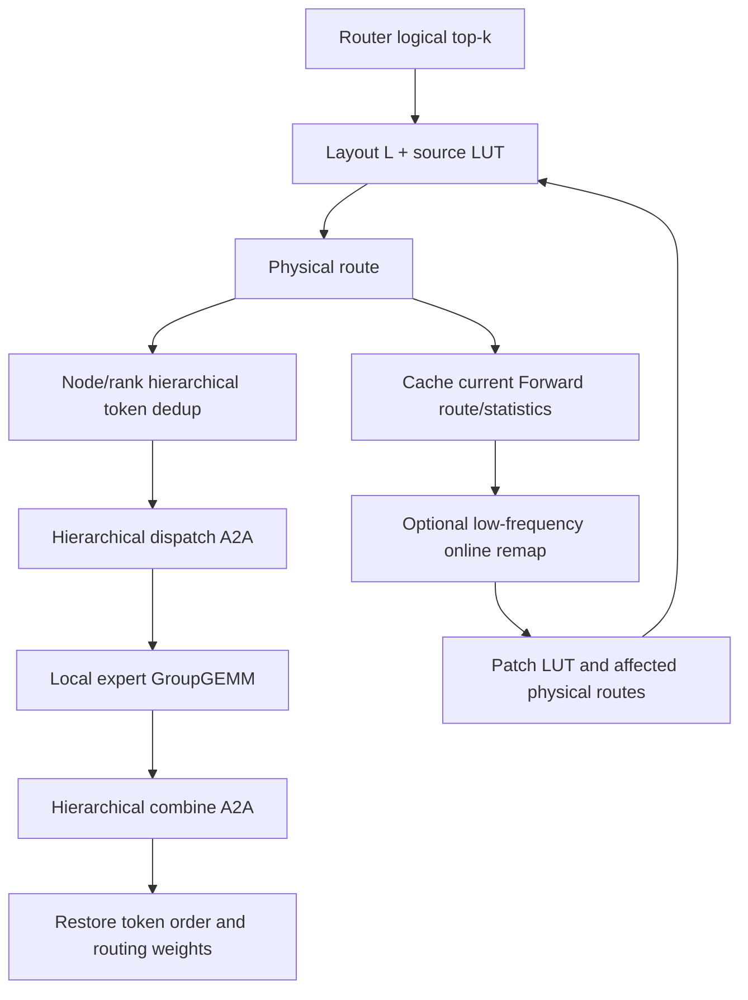

# HierMoE / Ours 功能、E2E 与消融实验指南

## 1. 文档目的

这份文档面向第一次接触当前实验分支的开发者，目标是快速回答：

1. 当前仓库实现了哪些 HierMoE、冗余专家和布局优化能力；
2. `layout`、owner、source LUT 和当前 Forward physical route 分别是什么；
3. VeOmni、HierMoE、fixed R2、EPLB 和 Ours 应如何做公平 E2E 比较；
4. Ours 的离线初始化与在线 remap 应如何做消融；
5. 哪些代码是最终实验路径，哪些仍属于历史或实验性路径。

本文以当前代码为准。历史性能记录仍可参考，但不能替代同一提交、同一配置下的严格配对实验。

> **重要警告**
>
> 历史脚本 `scripts/profile/run_hiermoe_paper8h_p0.sh` 中名为 `hiremoe`
> 的 case 使用 `hierarchical_full_static` 和一份静态 replay，并不是
> `hiermoe_exact_p1` 在线精确交换，不能将该历史结果当作论文方法。
> 新的 paper32 矩阵已经提供正式的 `hiermoe_exact_p1` 入口。

## 2. 十分钟快速上手

建议按以下顺序阅读代码：

1. `veomni/distributed/moe/hiermoe/state.py`
   - 全局 HierMoE 配置、状态保存和恢复。
2. `veomni/distributed/moe/hiermoe/all_to_all.py`
   - 多级 token 去重 dispatch/combine。
3. `veomni/distributed/moe/hiermoe/expert_swap.py`
   - 当前 placement manager、布局安装、迁移、梯度同步、exact swap、
     static replay 和在线 remap 的训练接入。
4. `scripts/profile/build_hiermoe_recursive_classifier_layout.py`
   - Ours 的离线聚类布局与 source LUT 生成器。
5. `veomni/distributed/moe/hiermoe/forward_cover_planner.py`
   - 复用 Forward physical route 的在线 cover/remap 原型。
6. `scripts/profile/launch_hiermoe_greedy_e2e_4node.sh`
   - 当前四节点实验变体与环境变量。
7. `scripts/profile/summarize_hiermoe_paper_case.py`
   - 稳态 E2E、A2A、MoE region、计算负载和显存指标的统一汇总口径。

如果只想运行最终静态方案，优先理解第 1～4、6、7 项；不需要先读旧的
CPU planner、layer-owner planner 或 full-exact greedy planner。

## 3. 核心概念

### 3.1 逻辑专家与物理槽

Router 输出的是逻辑专家 ID：

```text
selected_experts[token, topk] -> logical expert
```

训练执行的是物理专家槽：

```text
physical_routes[token, topk] -> physical slot
```

一个逻辑专家至少有一个物理槽，也可能有多个副本。

### 3.2 布局 L

本文用 `L` 表示：

```text
slot_to_logical[physical_slot] -> logical expert or EMPTY(-1)
```

它回答“每个 NPU 的每个物理槽中装载了哪个逻辑专家”。

### 3.3 Owner

```text
owner_slot[logical expert] -> canonical physical slot
```

Owner 不决定所有 token 必须使用哪个副本。它主要用于：

- 保证每个逻辑专家至少存在一个副本；
- checkpoint 的规范语义；
- 冗余梯度同步和梯度范数只计一次；
- 覆盖或迁移时保护最后一个副本。

### 3.4 Source LUT

```text
source_lut[source EP rank, logical expert] -> physical slot
```

它回答“来自某个 source rank 的 token 请求某个逻辑专家时，默认使用哪个
物理副本”。

Source LUT 是静态布局能够直接用于 Forward 的关键状态。它不是根据历史
数据预测 token 将来自哪里，而是为每一个可能的实际 source rank 都给出
确定的服务副本。

### 3.5 Forward physical route

当前层 Router 完成后，可以用当前 LUT 生成：

```text
physical_routes = source_lut[current_source_rank][selected_experts]
```

运行时还会缓存：

- `latest_selected_experts`
- `latest_physical_routes`
- 当前 Forward 的分层 traffic endpoint statistics

在线 remap 可以复用这些结果，只 patch 获胜专家的 affected positions，
避免重新扫描所有专家和所有副本。

## 4. 训练数据流



反向完成后：

```text
all backward
  -> redundant expert gradient synchronization
  -> owner-only global grad norm
  -> apply one clip coefficient to all physical copies
  -> optimizer.step
  -> optional placement/migration boundary
```

必须保留以下训练生命周期约束：

- 可训练模型 Forward 必须位于
  `BaseTrainer.hiermoe_layer_swap_forward()`；
- activation checkpoint 重计算不能再次触发 placement；
- frozen/reference model 必须禁用 placement，但可保留 token dedup；
- 每个 optimizer step 必须到达 step-end placement fallback；
- 冗余槽预算必须与 checkpoint 保存时一致。

## 5. 多级去重通信与计算负载

### 5.1 去重通信

对一个 token，通信量由不同 destination group 的集合决定，而不是简单的
token-expert assignment 数。

两级拓扑中分别统计：

```text
node level: token 需要到达多少个不同目标 node
rank level: token 在 node 内需要到达多少个不同目标 rank
```

同一个 token 如果被同一目标 node/rank 上多个专家需要，在该层级只发送
一次。

### 5.2 非去重计算

专家计算使用非去重 assignment：

```text
A_r = rank r 实际执行的 token-expert assignments
A_max = max_r A_r
```

同一个 token 被同一 NPU 上两个专家处理，仍然产生两次专家计算。

### 5.3 当前离线混合 Cost Model

Ours 的 exact evaluator 使用 source LUT 生成真实 physical route，然后计算：

```text
T_total = T_communication + T_compute
```

其中：

- `T_communication`
  - 节点间和节点内分别统计去重后的 traffic endpoint；
  - 使用 `inter_ms_per_byte`、`intra_ms_per_byte`；
  - `route_ms_per_assignment` 吸收随 assignment 增长的本地路由/打包工作；
  - 再乘 `communication_phase_multiplier`。
- `T_compute`
  - 基于最忙 rank 的非去重 assignment；
  - 使用 `compute_ms_per_assignment`；
  - 再乘 `compute_phase_multiplier`。

常用的当前参数默认值可以从
`build_hiermoe_recursive_classifier_layout.py --help` 查看。系数只能用于相同
模型、hidden size、dtype、通信拓扑和训练阶段；更换模型或平台后应重新校准。

## 6. 比较方法的准确定义

### 6.1 HierMoE exact P1

组成：

```text
hierarchical deduplicated A2A + one exact expert-pair swap
```

当前实现的关键约束：

- 每个逻辑专家只有一个物理位置；
- 不支持冗余槽；
- 每层最多接受一个严格正收益专家对；
- 使用当前 route 的精确多级去重通信统计；
- 当前闭式 scorer 依赖单值 `logical expert -> physical group`。

因此它应作为独立基线，不能直接与多副本 Ours 布局共用当前 scorer。

### 6.2 Fixed R2

组成：

```text
hierarchical deduplicated A2A + two copies per logical expert
```

特征：

- 每个专家副本数完全相同；
- 物理布局为确定性镜像布局；
- 不根据 route 共现或 assignment 重新聚类；
- 可使用镜像 R2 remap 快路径；
- 是冗余容量为一整套专家时的重要稳定基线。

### 6.3 EPLB

当前适配器：

1. 从相同 Forward route profile 统计专家 demand；
2. 调用官方 EPLB 生成副本数和 rank placement；
3. 修复同 rank 无效重复副本；
4. 为每个逻辑专家指定 owner；
5. 编译成与 HierMoE Forward 一致的 source LUT；
6. 输出静态 preload/replay JSON。

EPLB 与 Ours 必须使用相同：

- route profile steps；
- EP size；
- 每 rank primary/redundant slot 预算；
- measured steady-state 训练配置。

### 6.4 Ours：离线聚类初始化

Ours 输出：

```text
physical layout L
+ owner slots
+ source LUT
```

算法分为四个阶段。

#### 阶段 A：构建 demand 与 affinity

从 route profile 统计：

- `demand[source rank, expert]`
- expert pair co-occurrence/affinity
- source-aware affinity

Affinity 表示专家被同一 token 共同选择的频率。把高 affinity 专家放在同一
node/rank，有机会提高 token 去重率。

#### 阶段 B：分配任意副本预算

总物理槽数不要求恰好为 `2 * num_experts`。

算法先保证每个专家一个 owner，再为剩余容量选择 replica multiset。完整专家
库副本和 residual budget 分开处理；residual 使用容量相容的 affinity class
产生候选，因此可支持每 rank 1、2、3、4 等不同冗余槽预算。

#### 阶段 C：统一 node/rank 分类

node 和 rank 都使用同一种可解释原语：

```text
reward: group 内专家共现
penalty: group 的最大非去重 assignment
constraint: group capacity
constraint: 同一个逻辑专家的两个实例不能放在同一 rank
```

先决定实例所在 node，再在每个 node 内决定 rank。

#### 阶段 D：L 与 LUT 交替优化

```text
instance layout
  -> build source LUT
  -> 按 LUT 分割副本 demand/affinity
  -> rebuild/refine layout
  -> rebuild LUT
```

每轮产生完整候选状态。最终不是由 affinity proxy 直接决定，而是由 exact
hybrid evaluator 使用真实 physical route 选择。

### 6.5 Ours：在线 remap

在线路径的目标不是重新运行昂贵的离线聚类，而是低频校正 L/LUT：

1. 复用当前层 Forward 的 logical route、physical route 和 traffic statistics；
2. 根据瓶颈产生少量 cover 候选；
3. 只对 winner 的 inserted/victim expert 找 affected positions；
4. 联合 patch 这些 positions，处理 add、eviction 和 token 共现 interaction；
5. 计算 winner 的全局通信和 assignment delta；
6. 预测收益不为正时选择 `None`；
7. 正收益时更新 L、source LUT 和对应 physical route。

当前在线 remap 是实验性路径，正式报告前必须单独证明：

- planner/remap 的直接开销；
- 专家迁移直接暴露时间；
- A2A 是否真的下降；
- MoE complete region 是否下降；
- E2E 是否下降；
- loss 是否与基线一致。

## 7. 代码地图

| 功能 | 主要位置 |
|---|---|
| HierMoE 配置 | `veomni/arguments/arguments_types.py` |
| 拓扑与通信模型 | `veomni/distributed/moe/hiermoe/topology.py`, `perf_model.py` |
| 多级去重 A2A | `veomni/distributed/moe/hiermoe/all_to_all.py` |
| 运行时布局/LUT/迁移/同步 | `veomni/distributed/moe/hiermoe/expert_swap.py` |
| exact P1 | `expert_swap.py` 中 `_plan_exact_single_swap_layers` |
| Forward-cache online cover/remap | `forward_cover_planner.py` 与 `expert_swap.py` |
| 旧 full-exact greedy planner | `greedy_planner.py`, `statistical_scorer.py` |
| Ours 离线初始化 | `scripts/profile/build_hiermoe_recursive_classifier_layout.py` |
| EPLB 适配 | `scripts/profile/build_hiermoe_eplb_layout.py` |
| 静态布局预加载 | `veomni/distributed/parallel_plan.py` |
| EP32 四节点底层实验入口 | `scripts/profile/launch_hiermoe_greedy_e2e_4node.sh` |
| EP32 单 case 入口 | `scripts/profile/run_hiermoe_paper32_case.sh` |
| EP32 20-case 矩阵 | `scripts/profile/run_hiermoe_paper32_matrix.sh` |
| EP32 route profile/layout | `scripts/profile/prepare_hiermoe_paper32_layouts.sh` |
| EP32/EP64 主矩阵 | `scripts/profile/run_hiermoe_paper32_matrix.sh`，通过 `PAPER32_WORLD_SIZE` 选择 32/64 |
| 收集多节点结果 | `scripts/profile/collect_hiermoe_paper_run.sh` |
| 单 case 汇总 | `scripts/profile/summarize_hiermoe_paper_case.py` |
| 论文矩阵汇总 | `scripts/profile/summarize_hiermoe_paper8h_matrix.py` |

不建议从以下历史路径开始理解最终算法：

- CPU planner；
- NPU layer-owner full-exact planner；
- quota/current-joint planner；
- group-cover oracle；
- pipeline-overlap prototype；
- 旧 forward LUT oracle/owner benchmark。

它们可用于追溯失败实验，但不是当前最终方法的入口。

## 8. 公平 E2E 实验矩阵

### 8.0 已冻结的论文主矩阵

当前采纳的主实验设计如下。除非某个 case 被证明无法运行并明确记录原因，
不应在执行过程中临时改变模型、workload、方法语义或统计窗口：

| 维度 | 冻结取值 |
|---|---|
| EP 拓扑 | EP32（4 节点）和 EP64（8 节点） |
| 模型 | Qwen3-VL-30B-A3B-Instruct 48L；Qwen3.5-35B-A3B-20L |
| 数据集 | ShareGPT4V；Tulu-3 |
| 方法 | VeOmni；Fixed R2；EPLB；HierMoE exact P1；Ours-static |
| 每个 case | 20 个 optimizer step，汇总实际第 11～20 步 |
| EP32 workload | MB=4，GBS=128，seq=4096 |
| EP64 workload | MB=4，GBS=256，seq=4096 |
| 正式 E2E case | `2 EP sizes × 2 models × 2 datasets × 5 methods = 40` |

这是 weak-scaling 主矩阵：EP64 只把全局 batch 从 128 增加到 256，保持每卡
micro batch 和 sequence length 不变。`MB=4, seq=8K` 或 `MB=8, seq=4K`
都会改变每卡 workload，不属于该主矩阵；如需研究长上下文，应单列 appendix
实验并重新采集 profile。

Qwen3.5 使用独立保存的前 20 层派生 checkpoint，以避免完整 40 层模型在
相同 workload 和冗余容量下的峰值显存风险。论文表格、图、manifest 和日志
必须始终标为 `Qwen3.5-35B-A3B-20L`，不能把它写成完整 35B 模型。不同模型
的绝对 step time 不用于判断方法优劣；每个 `model × dataset × EP size`
分组都以自己的 VeOmni case 为 `1.0×` 计算 speedup。

配套校准与 profile 的冻结数量为：

```text
通信校准:
  EP32 一次 + EP64 一次 = 2 份 topology-specific 通信模型

模型计算校准:
  Qwen3-VL 一份 + Qwen3.5-20L 一份 = 2 份模型曲线
  EP64 先验证同型号 NPU 上的曲线，误差 >5% 才重拟合

Forward route profile:
  2 EP sizes × 2 models × 2 datasets = 8 份
```

通信模型、route profile、EPLB layout 和 Ours layout 都不能跨 EP32/EP64
复用。模型计算曲线只有在相同 expert shape、dtype、kernel 和设备型号下才可
先复用，并必须通过 EP64 抽查。

### 8.1 主比较

论文精简主表固定为以下五种方法。`Dedup only`、`Ours-online` 和其他组件变体
只进入消融表，不混入主矩阵：

| 方法 | Dedup A2A | 布局 | 副本 | LUT/remap | 副本梯度同步 | 计时区间内 planner |
|---|---|---|---|---|---|---|
| VeOmni baseline | 否 | 原生 EP | 否 | 原生 routing | 不适用 | 否 |
| Fixed R2 | 是 | 确定性镜像 R2 | 均匀冗余 | R2 remap | blocking | 否 |
| EPLB | 是 | profile 驱动 EPLB | 可变 | static source LUT | blocking | 否 |
| HierMoE exact P1 | 是 | 历史路由驱动 exact swap | 否 | 单值 owner | 不适用 | exact P1（step mode） |
| Ours-static | 是 | 通信/计算联合聚类 | 可变 | optimized source LUT | **hidden** | 否 |

这里让 R2、EPLB、HierMoE 和 Ours 都使用同一套多级去重 A2A，是为了避免
把 Ours 的通信实现优势和布局算法优势混在一起。VeOmni baseline 刻意保持
原生、无去重、无冗余、无交换，作为完整系统的 `1.0×` 锚点。

主表中的 Ours 是静态版本：先用独立 Forward profile 构建 `L + LUT`，重新
启动正式训练，在统计窗口内不执行在线 Cover。在线 Cover、动态 LUT 和迁移
隐藏只作为后续消融，不作为当前主表结果。

### 8.2 必须固定的公平性条件

所有 case 必须保持一致：

- Git commit；
- 模型和 checkpoint；
- 数据集、数据顺序和随机种子；
- micro/global batch；
- sequence length；
- EP/FSDP/SP 配置；
- MoE kernel；
- dtype；
- activation checkpoint；
- 冗余槽预算；
- 各方法预先声明的梯度同步口径；
- profile step 区间；
- full timing ranks；
- HCCL 和容器环境。

冗余方法还必须使用完全相同的物理槽总数。不能将不同容量的 R2、EPLB 和
Ours 直接比较。主表比较完整系统，因此冗余梯度同步隐藏只在 Ours 开启；
R2/EPLB 显式使用 blocking。该差异必须在组件消融中单独报告，不能在主表
中隐去。

### 8.3 稳态范围

推荐 paper-style 长运行：

```text
step 0...10: warmup / cache / optional initialization
step 11...20: steady-state measurement
```

短消融可以使用：

```text
step 0...2: warmup
step 3...5: steady-state measurement
```

初始化 planner、静态 expert preload 和首次编译时间必须单独报告，不能混入
稳态 step 平均值。

### 8.4 拓扑、模型和 Profile 的校准作用域

通信、专家计算和 Forward 路由不能使用同一个“全局通用”校准结果。目标矩阵
使用以下作用域：

| 输入 | EP32 | EP64 | 总数 |
|---|---:|---:|---:|
| 集群通信校准 | 1 | 1 | 2 |
| 模型专家计算校准 | 2 | 先验证，误差超限时重拟合 | 至少 2 |
| Forward 路由 profile | 4 | 4 | 8 |

集群通信校准在同一拓扑中的所有模型和数据集间共享。EP32 与 EP64 必须分别
校准，因为跨节点数量、HCCL 算法和拥塞行为不同。每次至少覆盖：

- 节点内 A2A；
- 跨节点 A2A；
- 实际 hierarchical A2A；
- 代表性的 payload size；
- 均匀与倾斜 split。

模型计算校准分别对应：

- Qwen3-VL-30B-A3B；
- Qwen3.5-35B-A3B-20L。

应拟合“每个本地专家的 token 数到 expert compute 时间”的关系，而不是只
记录一个平均 `ms/assignment`。模型层数只影响总调用次数；expert hidden
size、MoE intermediate size、dtype 和 kernel 决定单层计算曲线。EP64 可以
先复用同型号 NPU 上的模型曲线，但必须抽查代表性 token bin；相对误差超过
5% 时重新拟合。

Forward 路由 profile 的作用域是：

```text
model × dataset × EP size
```

因此两个模型、两个数据集、两个 EP size 共需要 8 份 profile。每份 profile
仍采集 4 个 Forward step，建议 step 0～2 用于布局优化，step 3 用作 held-out
验证。Profile run 只用于 route capture；布局构建完成后，各方法必须从相同
初始 checkpoint 和数据顺序重新启动训练，不能接着 profile run 直接测 E2E。

## 9. 推荐运行流程

### 9.1 记录版本和配置

```bash
git rev-parse HEAD
git status --short
```

每个 run 都应保存：

- commit SHA；
- launcher 环境变量；
- layout/replay JSON；
- layout report；
- rank0～31 MoE timing；
- rank0 full timing 和 env metrics；
- 四节点 host log。

### 9.2 采集共享 route profile

使用 dedup-only 或固定布局采集，不要在 capture run 中比较 E2E：

```bash
E2E_VARIANT=dedup \
HIERMOE_CAPTURE_ROUTES=1 \
HIERMOE_CAPTURE_MODE_OVERRIDE=local \
HIERMOE_CAPTURE_STEP_OVERRIDE=-1 \
MAX_STEPS_OVERRIDE=4 \
FULL_PROFILE_START_STEP_OVERRIDE=99 \
RUN_NAME_OVERRIDE=<profile-name> \
bash scripts/profile/launch_hiermoe_greedy_e2e_4node.sh
```

Route capture 会发生 D2H 和文件写入，因此只能作为布局输入，不是性能 run。

### 9.3 构建 Ours 静态布局

示例：

```bash
python scripts/profile/build_hiermoe_recursive_classifier_layout.py \
  --route-root route_captures/<profile-name> \
  --optimize-steps 0,1,2 \
  --validation-steps 3 \
  --layers 48 \
  --ep-size 32 \
  --ranks-per-node 8 \
  --num-experts 128 \
  --primary-slots-per-rank 4 \
  --slots-per-rank 8 \
  --workers 24 \
  --candidate-workers 1 \
  --worker-threads 1 \
  --output-layout results/<ours-layout>.json \
  --output-report results/<ours-report>.json
```

必须检查 report：

- 每层 `strategy`；
- `copy_counts`；
- `optimize.total_ms`；
- `validation.total_ms`；
- `planner_ms`；
- `exact_route_evaluations`；
- aggregate `validation_speedup`；
- aggregate `e2e_eligible`；
- `serialization_mode`。

如果 validation cost 比比较对象更差，先停止，不要启动昂贵 E2E。

### 9.4 构建 EPLB 布局

```bash
python scripts/profile/build_hiermoe_eplb_layout.py \
  --eplb-root <official-eplb-root> \
  --route-root route_captures/<profile-name> \
  --profile-steps 0,1,2,3 \
  --layers 48 \
  --ep-size 32 \
  --ranks-per-node 8 \
  --num-experts 128 \
  --primary-slots-per-rank 4 \
  --redundant-slots-per-rank 4 \
  --output-layout results/<eplb-layout>.json \
  --output-report results/<eplb-report>.json
```

### 9.5 运行 fixed R2

```bash
E2E_VARIANT=fixed_r2_mirrored_pipeline_grad \
RUN_NAME_OVERRIDE=<r2-run> \
MAX_STEPS_OVERRIDE=20 \
FULL_PROFILE_START_STEP_OVERRIDE=11 \
FULL_PROFILE_EVERY_N_OVERRIDE=1 \
FULL_PROFILE_RANKS_OVERRIDE=0 \
bash scripts/profile/launch_hiermoe_greedy_e2e_4node.sh
```

梯度同步模式必须通过显式 override 固定，不能依赖不同 variant 的默认值。

### 9.6 运行 EPLB/Ours 静态布局

```bash
E2E_VARIANT=hierarchical_full_static \
RUN_NAME_OVERRIDE=<run-name> \
MAX_STEPS_OVERRIDE=20 \
FULL_PROFILE_START_STEP_OVERRIDE=11 \
FULL_PROFILE_EVERY_N_OVERRIDE=1 \
FULL_PROFILE_RANKS_OVERRIDE=0 \
HIERMOE_REDUNDANT_SLOTS_OVERRIDE=4 \
HIERMOE_GREEDY_MAX_COPIES_OVERRIDE=8 \
HIERMOE_ABLATION_REPLAY_PATH_OVERRIDE=<layout-json-in-container> \
bash scripts/profile/launch_hiermoe_greedy_e2e_4node.sh
```

如果 layout 包含 inactive/empty physical slots，应同时通过 static preload 路径
在模型构建阶段安装准确的参数形状和布局，不能只在训练开始后修改 metadata。

### 9.7 HierMoE exact P1

正式 exact-P1 case 使用：

```bash
E2E_VARIANT=hiermoe_exact_p1 \
bash scripts/profile/launch_hiermoe_greedy_e2e_4node.sh
```

它展开为以下配置：

```text
HIERMOE_ENABLE=true
HIERMOE_TOKEN_DEDUP=true
HIERMOE_EXPERT_SWAP=true
HIERMOE_EXPERT_SWAP_SELECTOR=hiermoe_exact_p1
HIERMOE_EXPERT_SWAP_MAX_PAIRS_PER_LAYER=1
HIERMOE_REDUNDANT_SLOT_INCREMENT_PER_DEVICE=0
HIERMOE_EXPERT_SWAP_MODE=step
```

四个 node 必须使用相同值和相同 rendezvous。不要复用历史上名为
`hiremoe` 的静态 replay case。

### 9.8 EP32 / EP64 精简论文主矩阵

目标主表在每个 EP size 上固定为：

```text
2 models × 2 datasets × 5 methods = 20 cases
```

EP32 与 EP64 合计 40 个正式 E2E case。脚本文件名保留历史 `paper32`
前缀，但当前 launcher、采集器、命名和节点列表已经支持 4 节点 EP32 与
8 节点 EP64。EP64 仍必须先通过 64-rank smoke，不能仅凭 dry-run 认为
环境和显存路径已经验证。

#### 9.8.1 模型

- `qwen3vl`
  - Qwen3-VL-30B-A3B-Instruct；
  - 保持完整 48 层和 128 个逻辑专家。
- `qwen35_20l`
  - 从原始 40 层 Qwen3.5-35B-A3B 抽取并保存的独立前 20 层 checkpoint；
  - 原始 checkpoint 为 `/home/share/Qwen3.5-35B-A3B`，建议派生 checkpoint
    固定保存为 `/home/share/Qwen3.5-35B-A3B-20L`；
  - 使用连续的前 20 层，并同步更新 `num_hidden_layers` 和 `layer_types`；
  - 保留 embedding、vision、final norm 和 LM head；
  - 结果和图表中必须命名为 Qwen3.5-35B-A3B-20L，不能写成完整 35B。

Qwen3.5-20L checkpoint 必须在进入矩阵前通过加载、Forward、Backward 和
首次 `Adam.step()` smoke。不能在每次 run 中先加载完整模型再临时跳过后
20 层；需要保存真正的部分 checkpoint，以降低加载和峰值显存。派生过程
必须重新生成 safetensors index，并保存来源、层范围和配置校验信息；不得
覆盖或修改原始 40 层 checkpoint。

#### 9.8.2 数据集和方法

数据集：

- `sharegpt4v`
- `tulu3`

方法：

- `baseline`: 原生 VeOmni，不启用多级去重、冗余专家、专家交换或
  HierMoE placement；
- `r2`: Fixed R2 + Hierarchical Dedup；
- `eplb`: EPLB Placement + Hierarchical Dedup；先根据匹配的 Forward profile
  构建布局，正式计时阶段冻结布局，不在最后 10 步增加或迁移副本；
- `hiermoe`: 正确论文语义的 HierMoE exact P1；没有冗余专家，保留多级
  All-to-All 去重，并根据历史路由执行每层至多一次的精确 swap；
- `ours`: Ours-static，不启用在线 Cover，并开启冗余专家梯度同步隐藏。

R2 与 EPLB 的冗余梯度同步显式设为 blocking；baseline 和 HierMoE 没有
冗余副本，因此不涉及副本梯度同步。这样主表比较的是各方法声明的完整系统，
Ours 的梯度同步隐藏收益再通过组件消融单独解释。

同一个 `model × dataset` 组的五种方法必须使用相同的模型训练开关，包括
`freeze_vit`、activation checkpoint、dtype 和 optimizer 配置。主矩阵不使用
FSDP CPU offload；若某个 workload 在部分方法上 OOM，应将该配置标为不支持并
修复共同 workload，不能只给 baseline 开 offload 或只降低某一种方法的负载。

#### 9.8.3 EP32 workload 和容量

两个模型使用相同的 token workload：

```text
EP size = 32
micro batch per NPU = 4
global batch = 128
maximum sequence length = 4096
```

应同时核对实际 `avg_effective_len` 和每步 consumed tokens，不能只比较名义
batch 参数。

容量翻倍时：

| 模型 | 专家数 | primary/rank | redundant/rank | total slots/rank |
|---|---:|---:|---:|---:|
| Qwen3-VL | 128 | 4 | 4 | 8 |
| Qwen3.5-20L | 256 | 8 | 8 | 16 |

#### 9.8.4 EP64 weak-scaling workload 和容量

EP64 主矩阵保持每卡 workload 不变，只把全局 batch 翻倍：

```text
EP size = 64
micro batch per NPU = 4
global batch = 256
maximum sequence length = 4096
```

容量翻倍时：

| 模型 | 专家数 | primary/rank | redundant/rank | total slots/rank |
|---|---:|---:|---:|---:|
| Qwen3-VL | 128 | 2 | 2 | 4 |
| Qwen3.5-20L | 256 | 4 | 4 | 8 |

EP64 主矩阵不能改成 `MB=4, seq=8K`，也不能在 OOM 后静默改成
`MB=8, seq=4K`。两者都会把每卡 workload 也翻倍，并改变 attention 占比、
路由共现和去重率，无法与 EP32 weak scaling 严格比较。8K 如需报告，应作为
单独的长上下文 appendix workload，使用自己的 profile 和配对基线。

#### 9.8.5 校准、Profile 和执行顺序

EP32 的前置步骤：

1. 在 huawei1 EP32 上执行一次通信校准；
2. 分别拟合 Qwen3-VL 和 Qwen3.5-20L 的专家计算模型；
3. 为两个模型和两个数据集采集 4 份独立的 4-step Forward route profile；
4. 基于各自 profile 生成 EPLB 和 Ours 静态布局；
5. 执行 20 个 E2E case。

每个 model/dataset 组内固定顺序：

```text
VeOmni baseline → R2 → EPLB → HierMoE → Ours
```

每个 case 运行 20 step，最后 10 步（11～20）用于汇总。每组五个 case
完成后立即按：

```text
speedup(method) = baseline_e2e_step_ms / method_e2e_step_ms
```

生成 baseline 固定为 `1.0×` 的柱状图和对应 JSON/CSV。

这里的“最后 10 步”以实际完成的 optimizer step 为准。若训练日志使用
零起始 step ID，汇总器必须在 JSON 中同时记录原始 step ID，避免把
“第 11～20 个 step”和日志中的 `step=11...20` 混淆。

EP32 全部结束且 huawei2 节点空闲后，才能开始 EP64：

1. 使用八节点 EP64 拓扑重新执行通信校准；
2. 验证两份模型计算曲线，误差超限时重拟合；
3. 重新采集 4 份 EP64 Forward route profile；
4. 重新生成 EP64 EPLB/Ours 布局；
5. 按相同顺序执行另外 20 个 E2E case。

EP32 的 route profile、layout、通信模型和 summary 不得直接复用于 EP64。
每个 artifact 名称必须包含 EP size、模型、数据集、方法、checkpoint 标识和
Git commit，防止更换模型或数据集后误用旧结果。

#### 9.8.6 完整矩阵与当前续跑范围

论文完整主矩阵仍是：

```text
EP32: 2 models × 2 datasets × 5 methods = 20 cases
EP64: 2 models × 2 datasets × 5 methods = 20 cases
总计: 40 cases
```

截至 2026-07-30，EP32 两个模型的 20 个主表 case 已完成并生成逐组
speedup 产物。当前续跑范围是 EP64，不应默认重跑 EP32：

```text
EP32:
  2 models × 2 datasets × 5 methods = 20 cases（已完成，按 manifest 审计）

EP64 待运行:
  2 models × 2 datasets × 5 methods = 20 cases

当前待运行正式 E2E:
  20 cases
```

当前目标执行时，应先审计和复用已经通过完整性检查的 EP64 校准、profile 和
layout 产物；只补齐缺失的 `model × dataset` 前置产物。复用必须依据 artifact
中的 EP size、checkpoint、dataset、workload、profile steps、冗余预算和源码
快照，而不是仅依据文件名。任何字段不一致都必须重新生成对应产物。

已有 EP32 结果只有在以下字段全部一致时才可计入完整矩阵：

- checkpoint 和模型层数；
- dataset 及确定性数据顺序；
- `MB=4, GBS=128, seq=4096`；
- 方法语义，尤其是正确的 HierMoE exact P1 和无在线 Cover 的 Ours-static；
- 20 个 optimizer step 及最后 10 步汇总；
- Git commit、容器镜像、EP32 拓扑和完整 rank 日志；
- 每个 model/dataset 组的 speedup JSON、CSV 和图。

若任一项不匹配，只重跑受影响的 case，不应默认重跑全部 EP32，也不能将
旧的不同 workload 或错误 `hiremoe` 语义结果补进主表。

#### 9.8.7 当前 EP32/EP64 入口和状态边界

准备独立 warm-cache 容器并执行关键 smoke：

```bash
bash scripts/profile/prepare_hiermoe_paper32_containers.sh
bash scripts/profile/run_hiermoe_paper32_matrix.sh smoke
```

正式入口默认会再次执行幂等的源码同步和容器预检；可先用
`run_hiermoe_paper32_matrix.sh dry-run` 展开并检查当前待运行范围。必须通过
`PAPER32_MODELS`、`PAPER32_DATASETS` 和 `PAPER32_METHODS` 显式声明本次范围，
不要依赖历史默认值。中断后重跑时，只有 checkpoint、commit、workload、
EP size、profile 和 layout 标识全部一致时才能复用已有结果。

正式矩阵必须使用显式模型标识 `qwen35_20l` 和独立 checkpoint
`/home/share/Qwen3.5-35B-A3B-20L`。不得使用含义不明确的 `qwen35` 别名，
也不得让 runner 回退到完整 40 层模型。EP32 正式入口为：

```bash
PAPER32_CONFIRM_FULL=1 \
bash scripts/profile/run_hiermoe_paper32_matrix.sh full
```

可用 `PAPER32_MODELS`、`PAPER32_DATASETS`、`PAPER32_METHODS` 缩小范围。
只有 profile 元数据完全匹配时才允许使用 `PAPER32_REUSE_PROFILE=1`。

EP64 使用同一矩阵入口，但必须显式选择 64-rank 作用域和八节点集群：

```bash
PAPER32_WORLD_SIZE=64 \
PAPER32_ARTIFACT_PREFIX=paper64 \
PAPER32_CLUSTER_SLUG=huawei12 \
PAPER32_MODELS="qwen3vl qwen35_20l" \
PAPER32_DATASETS="sharegpt4v tulu3" \
PAPER32_METHODS="baseline r2 eplb hiermoe ours" \
PAPER32_CONFIRM_FULL=1 \
bash scripts/profile/run_hiermoe_paper32_matrix.sh full
```

EP64 启动前必须完成八节点 preflight、64-rank smoke、EP64 通信校准、4 份
EP64 route profile 和对应 EPLB/Ours layout。即使 EP32 artifact 文件名看似
兼容，也不得跨拓扑复用。

每组五个 case 成功完成后应保存：

```text
results/<artifact-prefix>_<model>_<dataset>_speedup_vs_veomni_<tag>.svg
results/<artifact-prefix>_<model>_<dataset>_speedup_vs_veomni_<tag>.json
results/<artifact-prefix>_<model>_<dataset>_speedup_vs_veomni_<tag>.csv
```

其中 EP32 使用 `artifact-prefix=paper32`，EP64 使用
`artifact-prefix=paper64`。

#### 9.8.8 每个阶段的完成判据

派生 checkpoint 完成：

- 新目录独立存在，原模型未被修改；
- config 为 20 层，index 不引用第 20～39 层参数；
- 所有 index tensor 可读取；
- Forward、Backward、首次 `Adam.step()` 均成功；
- 保存 checkpoint manifest 和 smoke 日志。

校准/profile/layout 完成：

- EP32、EP64 各有独立通信校准报告；
- 两个模型都有计算曲线，EP64 抽查误差不超过 5%，否则有重拟合报告；
- 每个 `model × dataset × EP size` 有独立 route profile；
- EPLB/Ours layout 与对应 profile、EP size、冗余预算严格匹配；
- layout feasibility、held-out validation 和 source LUT 合法性检查通过。

E2E case 完成：

- 四节点 EP32 或八节点 EP64 的所有 rank 正常退出；
- 20 个 optimizer step 完整，无 OOM、HCCL error、NaN/Inf loss；
- 最后 10 步的 E2E、吞吐、A2A、MoE region、compute、显存和 loss 可汇总；
- run manifest 记录模型、数据、方法、workload、commit、镜像、校准、profile
  和 layout ID；
- 失败 case 保留日志并明确标为 failed，不能通过降低 batch、改变序列长度、
  更换方法或复用错误 artifact 静默绕过。

一组 `model × dataset` 完成：

- 五个方法均成功且配置审计通过；
- 生成 VeOmni=`1.0×` 的 speedup SVG/PNG、JSON 和 CSV；
- 表中同时保留绝对 step time 与 speedup，不能只画相对值。

整个目标完成：

- EP32 的完整 20-case 主表可由“已审计 Qwen3-VL 10 case + 新 Qwen3.5
  10 case”重建；
- EP64 的 20 case 全部完成；
- 两个拓扑各有总表、逐组图和异常清单；
- 所有结果路径、失败与重跑关系均记录在最终 manifest 中。

#### 9.8.9 目标模式建议文本

目标模式应描述最终交付物和不可变约束，而不是只写“把实验跑完”。推荐以
以下六类信息构成目标：

1. 明确剩余范围和不重复运行的已有结果；
2. 固定模型、数据集、方法及每种方法的语义；
3. 固定 EP size、batch、sequence length、step 和统计区间；
4. 指定校准、profile、layout 的依赖顺序与不可跨拓扑复用规则；
5. 指定允许的外部操作和禁止事项；
6. 用 checkpoint、日志、summary、图表和 manifest 定义完成，而不是用
   “作业已启动”定义完成。

可直接使用本文末附录中的目标模板；如果只执行一个阶段，应删去其他阶段，
而不是保留含糊的“有时间再跑”。

### 9.9 收集并汇总

```bash
bash scripts/profile/collect_hiermoe_paper_run.sh <run-name>

python scripts/profile/summarize_hiermoe_paper_case.py \
  --run-name <run-name> \
  --start-step 11 \
  --end-step 20 \
  --layout-report results/<layout-report>.json \
  --output results/<run-name>_summary.json
```

汇总器要求：

- 与 EP size 相同数量的 rank MoE timing 文件完整（EP32 为 32，EP64 为 64）；
- steady range 中 rank0 full timing 和 env metrics 完整；
- 缺失记录会直接失败，而不是静默计算不完整平均值。

## 10. Ours 消融实验

### 10.0 收敛后的容量与组件矩阵

锚点工作负载使用 10 个独立训练配置，统一基线是没有启用 HierMoE、
token dedup、冗余专家、布局优化或 source LUT 的 Vanilla VeOmni。

容量实验运行完整 Ours，只改变冗余率：

```text
rho = 0, 0.25, 0.50, 0.75, 1.00
```

其中 `rho=0` 仍会优化唯一专家布局和 source LUT，因此不等于仅多级去重。

组件消融固定 `rho=1`：

```text
A  hierarchical dedup only
B  A + mirrored static R2
C  A + static replicas + communication-only layout objective + initial LUT
D  A + static replicas + communication/assignment joint objective + initial LUT
E  A + static replicas + communication/assignment joint objective + optimized LUT
```

新增在线 LUT 消融：

```text
F  E + online source-LUT correction with fixed physical layout
```

新增冗余梯度同步消融：

```text
G  E + blocking redundant-gradient synchronization
```

E 与容量实验的 `rho=1` 是同一个配置，因此：

```text
1 vanilla baseline + 5 capacity cases + 7 component cases - 1 overlap
= 12 independent cases
```

除 G 外，所有 case 显式使用隐藏冗余梯度同步；G 保持同一份 Full Ours
静态布局和 LUT，仅将梯度同步改成 blocking。Planner 是离线阶段，不计入稳态
E2E。A--E 和 G 的静态布局与 LUT 在测量区间内保持冻结；F 固定物理布局，
只允许 source LUT 在线切换到同一逻辑专家的其他现存副本，不执行
Cover/Swap 或专家迁移，在线 LUT planner 的耗时计入稳态 E2E。

G 的正式 case 名为 `ablation_grad_blocking`。矩阵会分别汇总 hidden 与
blocking 的 step 11--20，并校验二者的布局 SHA256、rank 数、计时来源和
梯度模式一致性；严格配对结果输出为
`results/paper32_<model>_<dataset>_grad_hiding_comparison_<tag>.{json,csv}`。

准备布局和 dry-run：

```bash
bash scripts/profile/run_hiermoe_ablation_matrix.sh prepare
bash scripts/profile/run_hiermoe_ablation_matrix.sh dry-run
```

运行完整锚点矩阵：

```bash
PAPER32_CONFIRM_ABLATION=1 \
bash scripts/profile/run_hiermoe_ablation_matrix.sh full
```

默认锚点是 `qwen3vl/sharegpt4v`。可以通过
`PAPER32_ABLATION_CASES` 只运行指定 case；通过
`PAPER32_ABLATION_MODEL` 和 `PAPER32_ABLATION_DATASET` 修改工作负载。

### 10.1 推荐优先级

第一组：证明静态算法贡献。

| 消融 | 保持 | 去掉/替换 | 回答的问题 |
|---|---|---|---|
| Default L + default LUT | Dedup、容量 | clustering、LUT 优化 | 最基础参考 |
| Ours L + default LUT | clustering L | LUT 交替优化 | 布局自身贡献 |
| Default L + Ours LUT | LUT | clustering L | LUT 自身贡献 |
| Node-only clustering | node affinity/load | rank clustering | rank 分类贡献 |
| Node+rank clustering | 完整分类 | online remap | 离线初始化收益 |
| No affinity | assignment balance | co-occurrence | 去重亲和性贡献 |
| No assignment term | affinity | max-assignment | 计算/本地负载贡献 |
| Uniform R2 copies | 相同容量 | non-uniform replica allocation | 副本数优化贡献 |

第二组：证明在线 remap 贡献。

| 消融 | 说明 |
|---|---|
| Ours-static | L/LUT 全程冻结 |
| LUT-only update | 不迁移专家，只更新 source LUT |
| Winner-only patch remap | 只 patch affected positions |
| Cover + blocking migration | 观察布局理论收益和迁移暴露 |
| Cover + hidden migration | 观察可隐藏上限 |
| Different interval | 例如每 10、50、100 step 校正 |
| Rank vs node service scope | 比较 victim/inserted expert 的服务粒度 |

### 10.2 每个消融必须报告

不能只报告裸 A2A。至少包括：

1. E2E step wall time；
2. tokens/s；
3. forward A2A critical-rank time；
4. backward A2A critical-rank time；
5. complete MoE communication region；
6. expert compute critical-rank time；
7. physical assignment rank CV；
8. physical assignment max/mean；
9. dedup ratio；
10. planner active/exposed time；
11. remap time；
12. expert migration raw/exposed time；
13. redundant grad sync raw/exposed time；
14. peak NPU allocated/reserved memory；
15. loss 序列。

## 11. 如何解释结果

### 11.1 A2A 变快但 E2E 变慢

依次检查：

1. planner 是否完全暴露；
2. expert migration 是否完全暴露；
3. `pre_all_to_all_region` 是否变慢；
4. physical assignment max/mean 是否恶化；
5. 各 rank 到达 A2A 的 straggler 是否增大；
6. gradient sync 虽然显示 hidden，是否仍通过资源竞争拖慢 backward；
7. remap 是否重新扫描完整 route；
8. layout 是否导致更不规则的 pack/sort/split。

### 11.2 Cost model 预测更好但真实 E2E 无收益

区分：

- `prediction error`：Cost Model 没有准确预测 measured MoE region；
- `search error`：Cost Model 准确，但 planner 没找到足够好的布局；
- `execution overhead`：布局确实更好，但 planner/remap/migration 抵消收益；
- `distribution shift`：profile routes 与测量期 routes 不一致。

不要用静默 fallback 隐藏问题。建议在 report/log 中保留：

- predicted baseline/final cost；
- measured baseline/final cost；
- winner action；
- `None` 的原因；
- profile/validation step；
- route distribution drift。

### 11.3 离线 validation 好但 E2E 差

首先用下一 profile step 做 held-out validation，而不是只验证 optimize steps。
其次确认离线 evaluator 和 Forward 使用完全相同的 source LUT 和 physical route。

## 12. 正确性检查

每次布局生成或在线更新后至少验证：

```text
每个逻辑专家至少一个 physical copy
owner slot 中确实是对应逻辑专家
source LUT 指向的 slot 中确实是对应逻辑专家
同一 rank 不保存同一个逻辑专家的无效重复副本
覆盖 victim 后没有 LUT 继续指向被覆盖 slot
所有 rank 提交相同 layout/LUT version
```

训练正确性：

- loss 与配对基线短跑一致；
- 所有副本 optimizer step 后参数一致；
- grad norm 只计 owner；
- activation checkpoint 重计算使用一致 mapping；
- save/resume 后 L、owner、LUT 和副本数恢复一致。

## 13. 当前已知限制与待整理项

1. `expert_swap.py` 同时包含多代 planner 和执行逻辑，理解成本高。
2. Ours/EPLB 仍从旧 hierarchical initializer 导入公共 evaluator 和 I/O helper。
3. `greedy_planner.py` 同时包含运行时 remap helper 和旧 full-exact planner。
4. 四节点 launcher 包含大量历史 variant，默认值不适合直接作为论文定义。
5. 多个脚本硬编码 `/home/tzq`、容器名、节点 IP 和密钥路径。
6. 脚本文件名仍保留 `paper32` 历史前缀，EP64 必须通过显式 world-size 和
   artifact prefix 选择，不能从文件名推断运行规模。
7. 历史结果中的 `hiremoe` 可能指 static replay；主矩阵只能使用
   `hiermoe_exact_p1` 的正确论文语义。
8. 在线 remap 尚未形成唯一、简洁、经过最终 E2E 验证的 canonical variant。
9. 更换模型、EP size 或冗余容量后，必须重新检查 layout feasibility、Cost
   Model 系数和 held-out validation。

在正式迁移或清理仓库前，应把本文中的主比较方法各自收敛为一个 canonical
launcher，并用同一提交完成一次短 E2E 回归。

## 附录 A：目标模式可复制模板

下面的目标适用于“EP32 已完成，继续完成 EP64”的当前状态。目标模式应描述
最终可验证成果、允许操作、禁止降级和异常处理；不要只写“启动矩阵”或
“运行到没时间为止”。启动前替换 `<实验提交或源码快照标识>` 和实际结果
根目录：

```text
目标：在不重跑已通过审计的 EP32 主矩阵、且不重复生成已经通过完整性检查
的 EP64 前置产物的前提下，完成 HierMoE 论文冻结版主矩阵的全部剩余 EP64
实验，并交付可审计的通信校准、Forward route profile、EPLB/Ours layout、
E2E summary、speedup 图表和最终 manifest。

源码固定为 <实验提交或源码快照标识>。先审计 EP32 的
2 models × 2 datasets × 5 methods 共 20 个结果；只有配置或产物不完整的
case 才允许重跑。Qwen3.5 必须使用独立 checkpoint
/home/share/Qwen3.5-35B-A3B-20L，不得回退到原始 40 层模型。

使用 huawei1_node1–4 + huawei2_node1–4 组成八节点 EP64。先完成所有节点
的容器、源码、模型、数据、EPLB 依赖和设备空闲状态检查，并通过一个
64-rank 训练 smoke。使用独立 EP64 通信校准；验证既有 Qwen3-VL 和
Qwen3.5-20L 计算曲线，误差超过 5% 时才重新拟合。为两个模型 ×
ShareGPT4V/Tulu-3 重新采集 4 份 EP64 Forward route profile，并分别构建
匹配的 EPLB 和 Ours-static layout。已经完成且元数据、文件数量、布局合法性
和 held-out validation 均通过审计的 EP64 产物可以直接复用；不得仅按文件名
复用，也不得复用 EP32 通信模型、route profile 或 layout。

完成 2 models × 2 datasets × 5 methods 共 20 个 EP64 E2E case。所有 case
固定 MB=4、GBS=256、seq=4096、20 个 optimizer step，并统计第 11～20 个
实际 optimizer step。Qwen3-VL 冗余预算为 B=2/rank，Qwen3.5-20L 为
B=4/rank。

五个方法依次为：VeOmni baseline；Fixed R2 + hierarchical dedup；
EPLB + hierarchical dedup；正确语义、无冗余专家的 HierMoE exact P1；
Ours-static。Ours 关闭在线 Cover、开启冗余专家梯度同步隐藏；R2/EPLB
使用 blocking 副本梯度同步。EPLB 和 Ours 在计时窗口内冻结布局。

每完成一个 model × dataset 的五方法组，立即生成以 VeOmni=1.0× 的
speedup 图、JSON 和 CSV，同时保留绝对 step time、A2A、完整 MoE region、
expert compute、显存和 loss。每个 case 完成或异常时都给出状态更新。
不同模型之间不比较绝对 step time；只在相同 model、dataset、EP size 和
workload 内计算 speedup。

允许检查节点、同步本任务源码和派生 checkpoint、创建本任务容器以及启动/
停止本任务进程。不得覆盖原 checkpoint、重启节点、终止无关进程，或静默
改变 batch、sequence length、模型层数、方法定义和统计区间。遇到 OOM、
HCCL error、非有限 loss、rank 日志缺失或配置不一致时，保留日志，报告异常，
定位并修复；未经明确授权不得用更小 workload 绕过。

目标仅在以下条件全部满足时完成：
- EP32 的 20-case 结果完成审计，EP64 smoke 和独立通信校准可审计；
- EP64 的 4 份 topology-specific route profile 和对应 layout 可审计；
- EP64 20 case 全部完成；
- EP32/EP64 每个 model × dataset 都有五方法 summary 和 speedup 图/JSON/CSV；
- 最终 manifest 记录所有 artifact 路径、配置、失败、修复和重跑关系；
- 没有 OOM、HCCL error、NaN/Inf、缺 rank 日志或 workload/方法语义不一致的
  case 被静默计入成功结果。
```

如果只希望执行某一个 `model × dataset` 组，应把目标明确截断为对应五个
case，并写明“完成图表后停止”。如果希望无人值守地跑完整 EP64，则保留上述
终止条件，并明确允许在不改变实验语义的前提下修复脚本、重跑失败 case 和
等待节点空闲。
